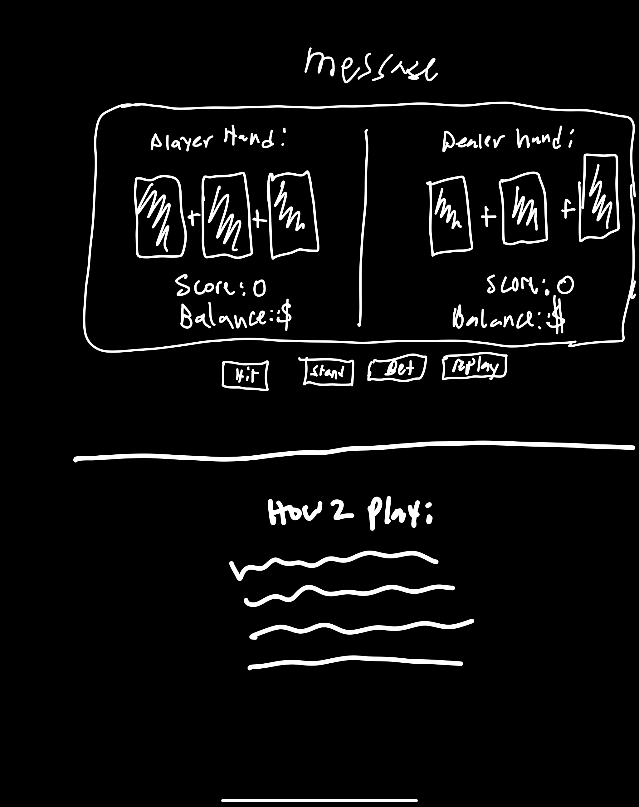

# Planning for Blackjack

## Analyze the app's functionality
### As a user...
i want to start with a set amount of cash to bet with.
i want to be able to place a bet.
i want to be able to hit.
i want to be able to stand.
i want the dealer to pay out 2x the bid amount if game is won by the player.
i want to be able to replay the game

## Nice to have
i want to be able to get a loan if playerBalance = 0 and continue playing.
i want to be able to go "All In"

## Think about the overall design (look & feel) of the app
- clean/minimalists
- font - Poppins

## wireframe

# Pseudocode:

## Constants
### Define card deck and card values
- using an array called deck: ["2", "3", "4", "5", "6", "7", "8", "9", "10", "J", "Q", "K", "A"] for the deck of cards
- using an object called values: {2: 2,3: 3,4: 4,5: 5,6: 6,7: 7,8: 8,9: 9,10: 10,J: 10,Q: 10,K: 10,A: 11,} for card values to    calculate the hand value.

## Define game state variables
- gameOver
- playerScore
- dealerScore 
- playerBalance
- dealerBalance
- dealerHand
- playerHand

## Add event listeners for buttons
- Add event listeners to the hit, stand, bet and playAgain buttons that call the appropriate functions when clicked.

## Define init function called init()
- initialize all game state variables 
- resets deck

## Define render function called render()
- check if game is over
- displays winner, bust, draw messages
- maps player and dealer hands and score to DOM elements
- renders dealerBalance and playerBalance
  
  
## Define function to handle player bet button called bet()
- define bet amount
- enable hit button
- enable stand button
- if bet is greater than or equal to playerBalance
    - place bet, update playerBalance and dealerBalance and start game
- if bet is not greater than or equal to playerBalance
    - return "not enough funds, you are broke"
    - disable hit/stand buttons
- render()

## Define function to handle hit button called hit()
- draw new card using drawCard function
- update playerScore
- checks for bust
- render()
  
## Define function to handle stand button called stand()
- disable hit and stand buttons
- dealer draws cards until their hand value is at least 17
- dealer reveals hand
- update dealer score and check for bust or win (if else statement)
- render()

## Define function to handle playAgain button called playAgain()
- calls init() function
- resets score
- resets buttons
- clears the table
- playerBalance will remain the same from previous game
- render()

## Define functions to draw cards called drawCard()
- generate a random index between 0 and the length of the deck array
- select a random card from the deck based on random index generated
- Add the selected card to the player's hand using .push
- Remove the selected card from the deck using .splice
- Update the display to show the updated hand

## Define function to calculate hand value called calculateHand()
- initialize sum and aces count to 0
- loop through each card in the hand
- get the value of the current card
- if the card is an ace:
    - increment the aces count by 1
- add the value of the card to the sum
- If the sum is greater than 21 and there are aces in the hand:
   - convert an ace from value 11 to value 1 by subtracting 10 from the sum

## Define function to check if hand is a Blackjack called isBlackjack()
- check if the hand has exactly two cards and a total value of 21
- returns boolean value indicating whether the hand is a BlackJack
- gameOver = true
- 
## Define function to check if hand is a bust called isBust()
- takes a hand as an argument
- checks if it is over 21
- returns a boolean indicating whether the hand is bust
- gameOver = true

